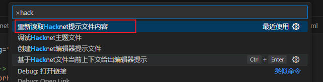
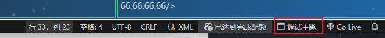

# 更新日志

## v0.1.5更新日志-2025-12-25

1. **Hacknet-EditorHint.xml中的Include标签在重新创建提示文件后会保留下来**
2. Hacknet-EditorHint.xml中定义多个相同的Node会自动合并/覆盖

基于此您可以实现：

在提示文件中您可以用**Include**标签引用其他的提示文件，在重新创建提示文件后也不会覆盖之前的Include引用。定义多个相同的Node提示，会自动合并，比如通过 `pathfinder`附加了属性或者修改了原本的属性，可以自定义一个提示文件覆盖规则然后在根提示文件中Include。

## v0.1.3更新日志-2025-12-25

新增文件级别关联的错误信息，在被依赖文件删除、改名或改动后，依赖其的文件会重新扫描并提供错误提示。

## v0.1.0更新日志-2025-12-23

新增错误提示功能，在用户输入错误的路径等属性时，编辑器会给出错误提示。

**更新后您需要手动重新创建编辑器提示文件才有最新提示，如果您在原本的提示文件中新增了内容，那么请您做好备份。**

## v0.0.9更新日志-2025-11-12

修复部分已经问题

## v0.0.8更新日志-2025-09-27

修复AddIRCMessage标签智能提示中，只能提示带有账户信息的计算机Link特殊消息

**更新后您需要手动重新创建编辑器提示文件才有最新提示，如果您在原本的提示文件中新增了内容，那么请您做好备份。**

## V0.0.7更新日志 - 2025-09-26

新增AddIRCMessage action标签中特殊内容的智能提示

1. 类任务附件中计算机链接样式的消息：!ATTACHMENT:link#%#计算机名#%#IP/ID
2. 类任务附件中计算机账户样式的消息: !ATTACHMENT:account#%#计算机名#%#IP/ID#%#账户#%#密码

以上2中类型的特殊消息，您可以通过按下快捷键或者输入计算机ID以获得编辑器提示

**更新后您需要手动重新创建编辑器提示文件才有最新提示，如果您在原本的提示文件中新增了内容，那么请您做好备份。**

## V0.0.5更新日志 - 2025-08-30

> 新增配置项

hacknetextensionhelperconfig.hintFile.autoRefresh （是否监听配置文件改变）默认true

当用户更改提示文件时，存在部分用户是默认更改文件立即保存的，在提示文件过大时可能导致保存过于频繁，您可以将新增配置项取消勾选，再编写完提示文件后，通过命令手动重新触发读取提示文件。

对于勾选了该配置的用户在编写并保存提示文件**3秒**后才会真正重新解析提示文件内容。

windows下按下快捷键 `ctrl + shift + p `输入hacknet后选择**重新读取Hacknet提示文件内容并执行**即可重新解析



> 新增提示文件本身内容提示

您更新到该版本后再写新的提示文件时有编辑器提示。但是需要您手动重新创建编辑器提示文件才有最新提示，如果您在原本的提示文件中新增了内容，那么请您做好备份。

## V0.0.4更新日志 - 2025-08-29

1. 修复 `AddMissionToHubServer`标签在不同任务系统中的不同提示。在玩家选择非DHS服务中表示是否添加到任务中心的顶部，提供枚举选择，在玩家选择含有**DHS**服务的计算机id时，表示是谁领取了任务，将提供玩家定义的所有dhs agent用户供玩家选择。
2. HackerScripts新增命令 `systakeover`命令高亮及提示。

更新后您需要手动重新创建编辑器提示文件才有最新提示，如果您在原本的提示文件中新增了内容，那么请您做好备份。

## V0.0.3更新日志 - 2025-08-29

xml提示文件 `Hacknet-EditorHint.xml`新增Include标签可引用其他提示文件。您可以在您项目中使用的其他mod单独写一份提示文件，以供其他人使用。

> 示例

```xml
<!-- 假设该文件位于项目相对路径的 Test/Test.xml中 -->
<HacknetEditorHint>
    <Node name="Test" enable="true" multi="false" desc="测试新增提示文件">
        <Content />
    </Node>
</HacknetEditorHint>


<!-- 下面的文件内容位于Hacknet-EditorHint.xml文件中，引用上面定义的Test.xml文件即可 -->
<HacknetEditorHint>
    <!-- XXX这里有一些提示的东西此处省略 -->
    <!-- 此处引用写的其他的提示文件，使用项目根目录的相对路径 -->
	<Include path="Test/Test.xml" />
</HacknetEditorHint>
```

## V0.0.2更新日志 - 2025-08-28

**新增在线调试主题功能**

您可以在主题的xml文件右下角点击调试主题按钮来在线调试主题



点击后会在侧边栏弹出网页模拟的界面，您更改xml后可立即在网页看到效果。

更方便的是，您在鼠标在网页想改的元素处停留3秒以上，该元素用到的颜色会在左侧xml文件中高亮出来，以便您能够更精准的定位到想要改的标签。
