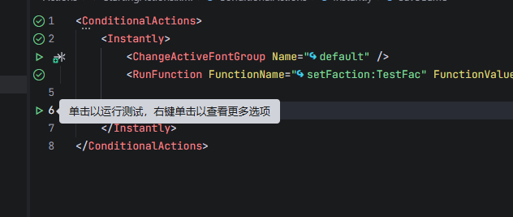
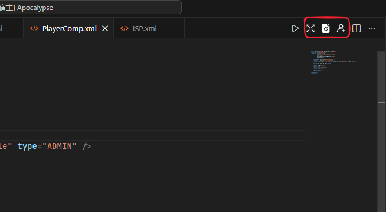
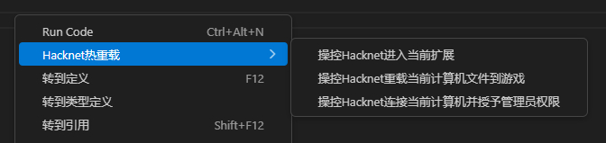
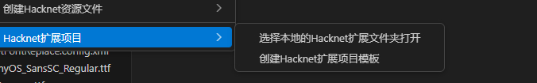
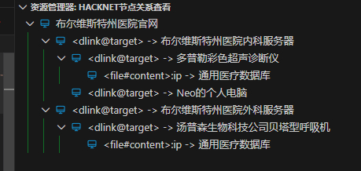

# 更新日志

## v0.4.2更新日志-2026-02-04

新增动态执行Action功能
您可以打开Action文件，点击编辑器行号左侧的执行按钮，会自动唤醒游戏执行该Action(请先进入扩展在执行)
注意：动态执行某个Condition下的所有action时是会自动忽略condition的条件


## v0.4.1更新日志-2026-02-03

新增热重载功能

热重载功能依赖[Pathfinder](https://github.com/Arkhist/Hacknet-Pathfinder)，您需要安装该组件后才可使用本功能

热重载功能实现依赖于PathFinder插件：[HacknetHotReplace](https://github.com/fengxu-30338/HacknetHotReplace)（由本人编写，已经开源到Github，您可以基于此实现其他热重载的客户端）

当前的功能有

1. 热重载Computer
2. 连接一台指定的Computer并授予管理员权限
3. 热重载Mission文件
4. 热重载Action文件
5. 热重载Faction文件
6. 热重载Theme文件
7. 热重载People文件（一次性所有People全部重新加载）

使用方法：

1.在文件编辑器右上角存在热重载图标，点击后即可热重载


2.在xml文档右击弹出的菜单中

会自动根据当前的文档类型推断可用的重载命令


## v0.3.6更新日志-2026-02-02

1.创建项目模板

您可以在文件夹右击选择Hacknet扩展->创建项目模板，即可创建一个HacknetExtension项目模板（要求根文件必须为空）



2.可链接文本提示

在可链接的文本的左侧现在会加上↪符号，以便您知道该处是一个可链接的文本。

## v0.2.9更新日志-2026-01-22

1. JS执行提示或校验时您可以在hacknetNodeHolder对象中调用Log函数来输出一些信息供您调试,在输出窗口选择 `HacknetExtensionHelper`通道即可查看。

```xml
<Attribute name="ip" required="false" desc="电脑的ip,不指定则由游戏自动生成" hint="js">
            (function(node, hacknetNodeHolder){
                const computers = hacknetNodeHolder.GetComputers();
                hacknetNodeHolder.Log("获取所有计算机");
            })
</Attribute>
```

2. 新增节点关系查看视图

   在标题栏依次点击  "查看"->"打开视图" 搜索Hacknet找到 `Hacknet节点关系查看`可以看到从当前计算机开始的依赖数
   

## v0.2.5更新日志-2026-01-10

新增命令选择本地所有hacknet扩展文件并选择一个打开，可通过快捷键ctrl+shift+p打开命令面板搜索hacknet或者在文件夹右击后选择

## v0.1.9更新日志-2025-12-27

在Hacknet文件右下角状态处新增查看编辑教程按钮，点击可跳转到该文件类型对应在Hacknet.wiki网站中的教程地址。

新增Hacknet节点查看器，在标题栏依次点击  "查看"->"打开视图" 搜索Hacknet找到 `Hacknet节点查看`即可打开

## v0.1.8更新日志-2025-12-27

从本版本开始,每次插件自动更新后会自动覆盖根目录的编辑器提示文件,请将您的自定义提示规则写入到其他文件并在根提示文件中通过Include标签引入(include引入在覆盖根提示文件时会自动保留).

补充了IRCDaemo标签的子标签user/agent用法.

## v0.1.7更新日志-2025-12-26

提示文件标签新增 `repeatRule`属性，描述多个相同的Node如何覆写规则

- `override`      覆写/追加 相同name的属性到node下
- `remove`         移除相同属性名称对应的Attribute定义
- `overrideItem`  合并相同属性名称定义的枚举类型
- `removeItem`     从上一个相同属性名称定义的枚举提示中移除相同定义

`AddIRCMessage`标签的 `Author`属性新增Channel提示

部分邮件属性标签中新增默认jmail提示以及默认admin账户提示。

## v0.1.5更新日志-2025-12-25

1. **Hacknet-EditorHint.xml中的Include标签在重新创建提示文件后会保留下来**
2. Hacknet-EditorHint.xml中定义多个相同的Node会自动合并/覆盖

基于此您可以实现：

在提示文件中您可以用**Include**标签引用其他的提示文件，在重新创建提示文件后也不会覆盖之前的Include引用。定义多个相同的Node提示，会自动合并，比如通过 `pathfinder`附加了属性或者修改了原本的属性，可以自定义一个提示文件覆盖规则然后在根提示文件中Include。

## v0.1.3更新日志-2025-12-25

新增文件级别关联的错误信息，在被依赖文件删除、改名或改动后，依赖其的文件会重新扫描并提供错误提示。

## v0.1.0更新日志-2025-12-23

新增错误提示功能，在用户输入错误的路径等属性时，编辑器会给出错误提示。

**更新后您需要手动重新创建编辑器提示文件才有最新提示，如果您在原本的提示文件中新增了内容，那么请您做好备份。**

## v0.0.9更新日志-2025-11-12

修复部分已经问题

## v0.0.8更新日志-2025-09-27

修复AddIRCMessage标签智能提示中，只能提示带有账户信息的计算机Link特殊消息

**更新后您需要手动重新创建编辑器提示文件才有最新提示，如果您在原本的提示文件中新增了内容，那么请您做好备份。**

## V0.0.7更新日志 - 2025-09-26

新增AddIRCMessage action标签中特殊内容的智能提示

1. 类任务附件中计算机链接样式的消息：!ATTACHMENT:link#%#计算机名#%#IP/ID
2. 类任务附件中计算机账户样式的消息: !ATTACHMENT:account#%#计算机名#%#IP/ID#%#账户#%#密码

以上2中类型的特殊消息，您可以通过按下快捷键或者输入计算机ID以获得编辑器提示

**更新后您需要手动重新创建编辑器提示文件才有最新提示，如果您在原本的提示文件中新增了内容，那么请您做好备份。**

## V0.0.5更新日志 - 2025-08-30

> 新增配置项

hacknetextensionhelperconfig.hintFile.autoRefresh （是否监听配置文件改变）默认true

当用户更改提示文件时，存在部分用户是默认更改文件立即保存的，在提示文件过大时可能导致保存过于频繁，您可以将新增配置项取消勾选，再编写完提示文件后，通过命令手动重新触发读取提示文件。

对于勾选了该配置的用户在编写并保存提示文件**3秒**后才会真正重新解析提示文件内容。

windows下按下快捷键 `ctrl + shift + p `输入hacknet后选择**重新读取Hacknet提示文件内容并执行**即可重新解析


> 新增提示文件本身内容提示

您更新到该版本后再写新的提示文件时有编辑器提示。但是需要您手动重新创建编辑器提示文件才有最新提示，如果您在原本的提示文件中新增了内容，那么请您做好备份。

## V0.0.4更新日志 - 2025-08-29

1. 修复 `AddMissionToHubServer`标签在不同任务系统中的不同提示。在玩家选择非DHS服务中表示是否添加到任务中心的顶部，提供枚举选择，在玩家选择含有**DHS**服务的计算机id时，表示是谁领取了任务，将提供玩家定义的所有dhs agent用户供玩家选择。
2. HackerScripts新增命令 `systakeover`命令高亮及提示。

更新后您需要手动重新创建编辑器提示文件才有最新提示，如果您在原本的提示文件中新增了内容，那么请您做好备份。

## V0.0.3更新日志 - 2025-08-29

xml提示文件 `Hacknet-EditorHint.xml`新增Include标签可引用其他提示文件。您可以在您项目中使用的其他mod单独写一份提示文件，以供其他人使用。

> 示例

```xml
<!-- 假设该文件位于项目相对路径的 Test/Test.xml中 -->
<HacknetEditorHint>
    <Node name="Test" enable="true" multi="false" desc="测试新增提示文件">
        <Content />
    </Node>
</HacknetEditorHint>


<!-- 下面的文件内容位于Hacknet-EditorHint.xml文件中，引用上面定义的Test.xml文件即可 -->
<HacknetEditorHint>
    <!-- XXX这里有一些提示的东西此处省略 -->
    <!-- 此处引用写的其他的提示文件，使用项目根目录的相对路径 -->
	<Include path="Test/Test.xml" />
</HacknetEditorHint>
```

## V0.0.2更新日志 - 2025-08-28

**新增在线调试主题功能**

您可以在主题的xml文件右下角点击调试主题按钮来在线调试主题


点击后会在侧边栏弹出网页模拟的界面，您更改xml后可立即在网页看到效果。

更方便的是，您在鼠标在网页想改的元素处停留3秒以上，该元素用到的颜色会在左侧xml文件中高亮出来，以便您能够更精准的定位到想要改的标签。
