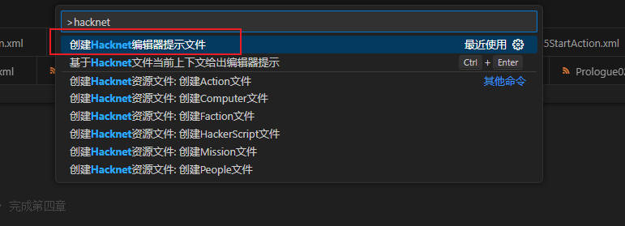
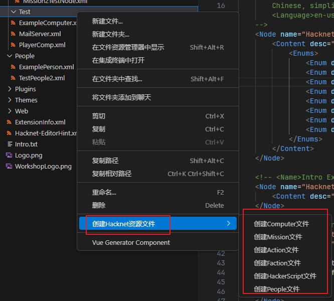
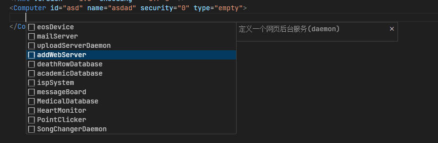
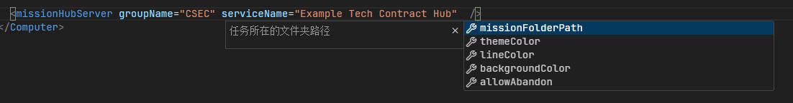
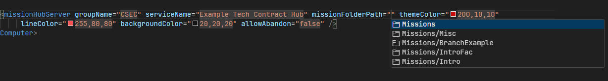
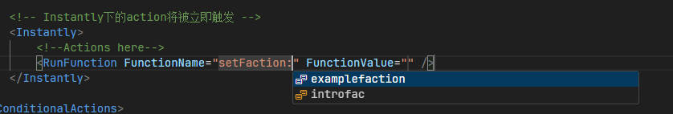
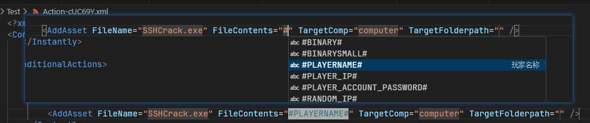
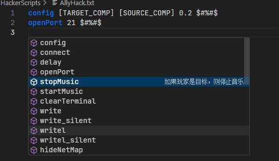
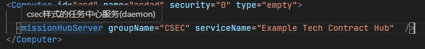

# 快速开始

1.创建编辑器提示文件

按下快捷键 Ctrl + Shift + P 输入hacknet，选择"**创建Hacknet编辑器提示文件**"运行



创建完毕后会在项目根目录生成一个Hacknet-EditorHint.xml文件，内部提供了编辑器的提示信息，您可以在使用Pathfinder定义了新的Action等标签后可自定义该文件以获得编辑器提示，自定义功能将在后续介绍。

现在您就可以开始愉快的编写Hacknet Extension文件了，可以通过`空格`或按下快捷键`ctrl + enter`触发提示。值得注意的是您在写标签时请尽量不要输入`'<xxx'`，这样会导致提示效果不好，您可以按照如下步骤输入以此获得更好的提示效果:

```xml
<!-- 
如果您需要添加一个admin标签您不应该输入<adxxx 这种类型，
您只需要输入ad不需要带开头的'<'符号将会获得更好的提示效果
或者您直接在想要提示的地方按下ctrl + enter快捷键将会获得更好的提示效果
-->
```

注意：**项目的根目录必须是hacknet扩展的根目录，不要一次性包含多个扩展，否则可能导致提示有误**

# 功能介绍

当前支持的功能有

- 创建模板
- xml文件提示
- #xx#文本高亮
- HackerScript文件提示及高亮
- 在线调试主题`(v0.0.2新增)`

## 1.创建模板文件

您在文件夹右击后，可以看到如下选项，选择一个可以帮助您快速创建各类模板文件



## 2.代码提示

您可以在编写以下类型的文件时基于您的上下文给您提示：

- Computer
- Action
- Mission
- Theme
- ExtensionInfo
- Faction
- HackerScript

您在需要提示的地方可以通过按下"Ctrl + 回车键"或按下`空格`来触发代码提示功能

> 代码提示示例

子标签提示：



属性名提示：



属性值提示：



Action文件的RunFunction分段提示



替换文本提示及高亮



HackerScript文件提示及高亮



插件会根据您当前光标的位置给予您最准确的提示信息，包括属性名(**部分属性非必选的不会直接出现，您可以通过快捷键触发完整提示**)、属性值、以及子标签提示。

## 3.查看标签详情

您可以将鼠标悬浮到某个标签或属性上方不动，以查看标签/属性的用法



## 4.符号跳转

您可以在以下地方，按住`Ctrl+鼠标左键`进行目标文件跳转

- 计算机ID
- 任意文件路径处（Action文件，Mission文件，音乐文件、图片文件等）

## 5.编写自定义提示规则

您可以通过在`Hacknet-EditorHint.xml`中添加规则来达到给你自定义标签提示的效果

### 基础示例

例如：定义一个Computer标签的提示(省略部分)：

```xml
<Node name="Computer" enable="true" multi="false" desc="定义一台计算机" fileTriggerPattern="Nodes/**/*.xml">
        <Content />
        <Attribute name="id" required="true" desc="电脑的ID" />
        <Attribute name="name" required="true" desc="电脑的名称" />
   		 <Attribute name="security" required="true" desc="电脑的安全等级" hint="enum">
            <Enums>
                <Enum desc="图标样式为旧台式电脑">0</Enum>
                <Enum desc="图标样式为一体机样式">1</Enum>
                <Enum desc="图标样式为办公电脑样式">2</Enum>
                <Enum desc="图标样式为服务器样式">3</Enum>
                <Enum desc="图标样式为更高级的服务器样式">4</Enum>
            </Enums>
       	 </Attribute>
 <Node/>
```

上面标示定义了一个Computer标签的提示，他将会在最外层给出提示Computer的提示

- name： 属性名
- enable：是否启用该标签的提示
- multi：该标签是否可以定义多个
- desc：标签的作用描述
- fileTriggerPattern：只在特定路径的文件上给出提示，比如此处就是所有Nodes文件夹下的xml文件才有Computer标签的提示

`Content`表示该标签存在子标签，只能定义一个,其**用法与Attribute完全一样**，唯一的限制就是只能定义一个

` Attribute`定义该标签的属性，可以存在多个，属性如下

- name: 属性名
- required： 该属性是否必选，否则不会生成在代码片段中，但任然会给用户提示
- desc：属性/内容的用途
- hint：提示类型，默认enum

> Hint提示类型介绍

当前支持的hint类型有


 1. Enum (枚举类型，用法如上图)
 2. EnumWithCommonString （在枚举的基础上，增加一些预定义的字符串，在代码提示文件中的CommonTextHint标签中定义）
 3. JavaScript （指定自定义js代码以获取提示，自由度最高）
 4. Computer （提供当前工作空间下的所有计算机ID供用户选择）
 5. ComputerOrEos （在Computer的基础上增加了eos设备id的提供）
 6. ActionFile (action文件路径)
 7. ThemeFile（主题文件路径）
 8. MisisonFile（任务文件路径）
 9. FactionFile（自定义派系文件路径）
10. PeopleFile （People文件路径）
11. Color （一个颜色，会提供5种随机生成的颜色供选择）
12. Path （路径选择，需要提供匹配路径的表达式）
13. Folder （文件夹选择，需要提供匹配路径的表达式）
14. Step（分步匹配，将字符串分成多段，每一段提供不同的匹配，非最后一段只能用hint="step"类型，最后一段可以用所有hint类型）

> js类型的hint用法

```xml
<!-- 
此处通过js获取当前工作空间下的所有计算机的ip属性提供给用户选择
node: 当前鼠标光标处的节点信息，可以获取的节点的属性名-属性值等关系
hacknetNodeHolder: 可以获取当前工作空间下的各种阶段信息，如computer,action,mission,faction,people,themes
	如：hacknetNodeHolder.GetComputers() 获取的是工作空间下的所有计算机信息，返回的是计算机数组，您可以通过调用其中子元素的
	GetRelativePath()方法获取到该元素所在文件的相对路径，您也可以通过调用其中子元素的属性来获取其在xml文件中定义的细节
[注意<>&等字符的转义]
-->
<Attribute name="ip" required="true" desc="加密所在计算机的IP" default="ip" hint="js" linkBy="Computer.ip">
    (function(node, hacknetNodeHolder){
        return hacknetNodeHolder.GetComputers()
            .filter(comp => comp.ip)
            .map(comp => {
            return {value: comp.ip, desc: comp.name, filterText: comp.id, kind: "reference"};
        });
    })
</Attribute>
```

> path/folder类型的hint用法

```xml
<!-- 
1.当您hint="path"或hint="folder"时，您必须在内容处设置path的匹配表达式
	比如此处**/*.ogg则表示匹配当前工作空间下的所有以.ogg结尾的文件，获取其相对路径供用户选择
	图片文件的表达式：>**/*.{png,jpg,jpeg,bmp,ico} 表示，文件可以以png,jpg等结尾
2.此种设置路径的提示方式通常与linkBy="path"结合使用，以达到跳转到目标文件的效果
-->
<Node name="HacknetExtension.IntroStartupSong" enable="true" multi="false" desc="设置第一次进游戏时播放的歌曲">
    <Content desc="歌曲文件路径(必须是.ogg格式)" hint="path" linkBy="path">**/*.ogg</Content>
</Node>
```

> Step类型的hint用法

```xml
<Node name="ConditionalActions.*.RunFunction|CustomFaction.Action.RunFunction" enable="true" multi="true" desc="执行内置方法">
    <Attribute name="FunctionName" required="true" desc="方法名" default="" hint="step">
        <LinkByCollection>
            <Item linkBy="Faction.id" linkByValuePattern="setFaction:(.*)" />
            <Item linkBy="path" linkByValuePattern="loadConditionalActions:(.*)" />
            <Item linkBy="Computer.id|Computer.eosDevice.id" linkByValuePattern="setHubServer:(.*)" />
            <Item linkBy="Computer.id|Computer.eosDevice.id" linkByValuePattern="setAssetServer:(.*)" />
            <Item linkBy="path" linkByValuePattern="playCustomSong:(.*)" />
            <Item linkBy="path" linkByValuePattern="playCustomSongImmediatley:(.*)" />
        </LinkByCollection>
        <Step value="addRank" desc="增加玩家在当前组织的等级并发送邮件通知" kind="function" />
        <Step value="addRankSilent" desc="增加玩家在当前组织的等级不发送邮件通知" kind="function" />
        <Step value="addRankFaction:" desc="增加玩家在指定组织的等级" kind="function">
            <Next hint="js">
                (function(actNode, hacknetNodeHolder){
                    return hacknetNodeHolder.GetFactions().map(node => {
                        return {value: node.id, kind: "enum"};
                    });
                })
            </Next>
        </Step>
     </Attribute>
</Node>
```

上面的示例展示了Step的用法，其基础用法类型于enum，对在初始给出用户Step中定义的value的提示，当用户选择某一项后再次进行提示时则进入Next标签定义的规则,Next标签用法与`Attribute标签一样`

### **子标签示例**

定义一个Computer标签的子标签示例:

```xml
<!--表示 <dlink target="advExamplePC2" /> -->
    <Node name="Computer.dlink" enable="true" multi="true" desc="设置本计算机可scan到的其他计算机">
        <Attribute name="dlink" required="true" desc="计算机ID" default="id" hint="computer" linkBy="Computer.id|Computer.eosDevice.id" />
    </Node>
```

多级子标签用`.`分隔，比如此处的dlink，name需要设置为`Computer.dlink`，设置name同时设置属于多个子标签，用`|`隔开，例如：

```xml
<!--
 同时属于多个标签的name示例
下方的name既属于ConditionalActions.*.ChangeNetmapSortMethod
也属于CustomFaction.Action.ChangeNetmapSortMethod
-->
<Node name="ConditionalActions.*.ChangeNetmapSortMethod|CustomFaction.Action.ChangeNetmapSortMethod" enable="true" multi="true" desc="更改网络图节点排序方式" />
```

**linkBy**属性表示根据匹配后的标签的实际属性/内容跳转到目标文件

```
例：Computer.id表示查找当前工作目录下所有计算机的id属性，如果与实际属性相等则跳转到具有该属性的目标文件，使用*可以匹配当前层级的任何属性名
```

```
使用|表示或运算，例如："Computer.id|Computer.eosDevice.id" 表示这两个属性存在一个匹配成功则整体匹配成功，但是第一层
```

**必须一样**此处就是必须都以`Computer.`开头

```
当前可用的有 Computer.* Mission.*  Action.*  Theme.* Faction.*  People.*  path(直接路径跳转)
```

### **多级linkBy**

```xml
<Node name="ConditionalActions.*.RunFunction|CustomFaction.Action.RunFunction" enable="true" multi="true" desc="执行内置方法">
    <Attribute name="FunctionName" required="true" desc="方法名" default="" hint="step">
        <LinkByCollection>
            <Item linkBy="Faction.id" linkByValuePattern="setFaction:(.*)" />
            <Item linkBy="path" linkByValuePattern="loadConditionalActions:(.*)" />
            <Item linkBy="Computer.id|Computer.eosDevice.id" linkByValuePattern="setHubServer:(.*)" />
            <Item linkBy="Computer.id|Computer.eosDevice.id" linkByValuePattern="setAssetServer:(.*)" />
            <Item linkBy="path" linkByValuePattern="playCustomSong:(.*)" />
            <Item linkBy="path" linkByValuePattern="playCustomSongImmediatley:(.*)" />
        </LinkByCollection>
        <Step value="addRank" desc="增加玩家在当前组织的等级并发送邮件通知" kind="function" />
        <Step value="addRankSilent" desc="增加玩家在当前组织的等级不发送邮件通知" kind="function" />
        <Step value="addRankFaction:" desc="增加玩家在指定组织的等级" kind="function">
            <Next hint="js">
                (function(actNode, hacknetNodeHolder){
                    return hacknetNodeHolder.GetFactions().map(node => {
                        return {value: node.id, kind: "enum"};
                    });
                })
            </Next>
        </Step>
     </Attribute>
</Node>
```

LinkByCollection表示同时定义一组linkBy的跳转规则，存在一条匹配成功则按匹配成功的那一条规则进行跳转

比如：

```xml
<Item linkBy="Faction.id" linkByValuePattern="setFaction:(.*)" />
```

用实际属性与linkByValuePattern中定义的正则进行匹配`(取捕获组的最后一个值)`，如果匹配成功则按Faction.id规则进行跳转，不成功则继续尝试下一条linkBy规则。

### 条件属性

您可以通过增加条件属性来动态进行属性提示的效果

示例：

```xml
<Node name="mission.goals.goal" enable="true" multi="true" desc="定义一个任务需要完成的目标">
    <Attribute name="type" required="true" desc="任务类型" default="" hint="enum">
        <Enums>
            <Enum desc="删除文件">filedeletion</Enum>
    </Attribute>
    <ConditionAttributes attr="type" match="^filedeletion$">
        <Attribute name="target" required="true" desc="待删文件所处的计算机ID" default="" hint="ComputerOrEos" linkBy="Computer.id|Computer.eosDevice.id" />
        <Attribute name="file" required="true" desc="文件名" default="file.txt" hint="enum" />
        <Attribute name="path" required="true" desc="文件所在路径" default="home" hint="enum">
            <Enums kind="value">
                <Enum desc="home目录">home</Enum>
                <Enum desc="exe文件存放目录">bin</Enum>
                <Enum desc="日志目录">log</Enum>
                <Enum desc="系统文件目录">sys</Enum>
            </Enums>
        </Attribute>
    </ConditionAttributes>
</Node>
```

使用ConditionAttributes定义一个条件属性，上述的意思是当实际标签的type属性满足match定义的正则表达式后，其内部定义的子属性才会被用于提示。

### 包含其他提示文件

版本>=`0.0.3`可用

xml提示文件`Hacknet-EditorHint.xml`新增Include标签可引用其他提示文件。您可以在您项目中使用的其他mod单独写一份提示文件，以供其他人使用。

> 示例

```xml
<!-- 假设该文件位于项目相对路径的 Test/Test.xml中 -->
<HacknetEditorHint>
    <Node name="Test" enable="true" multi="false" desc="测试新增提示文件">
        <Content />
    </Node>
</HacknetEditorHint>


<!-- 下面的文件内容位于Hacknet-EditorHint.xml文件中，引用上面定义的Test.xml文件即可 -->
<HacknetEditorHint>
    <!-- XXX这里有一些提示的东西此处省略 -->
    <!-- 此处引用写的其他的提示文件，使用项目根目录的相对路径 -->
	<Include path="Test/Test.xml" />
</HacknetEditorHint>
```

## 6.在线调试主题功能

版本>=`0.0.2`可用

您可以在**主题**的xml文件右下角点击调试主题按钮来在线调试主题


点击后会在侧边栏弹出网页模拟的界面，您更改xml后可立即在网页看到效果。

更方便的是，您在鼠标在网页想改的元素处停留3秒以上，该元素用到的颜色会在左侧xml文件中高亮出来，以便您能够更精准的定位到想要改的标签。