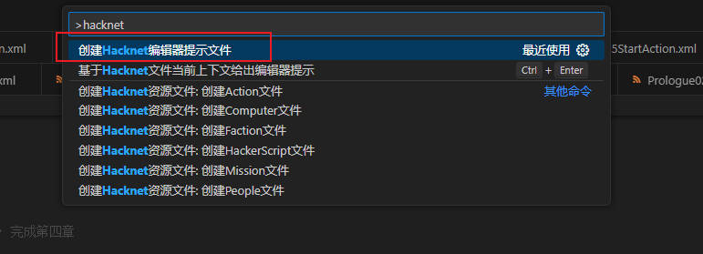
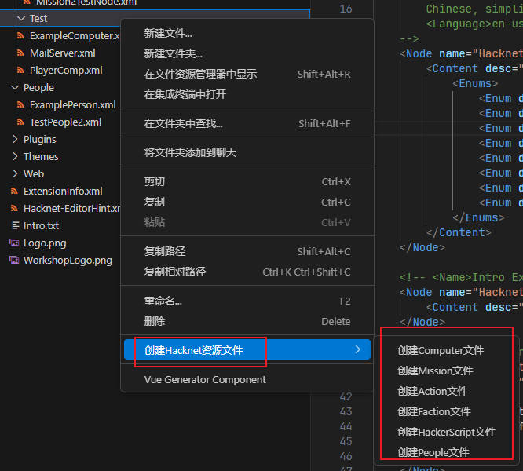
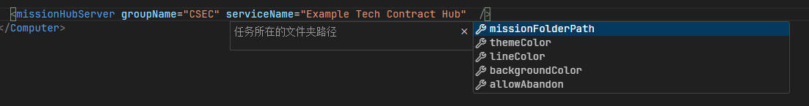
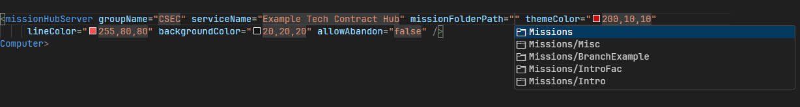
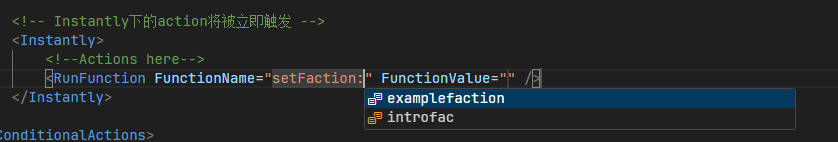
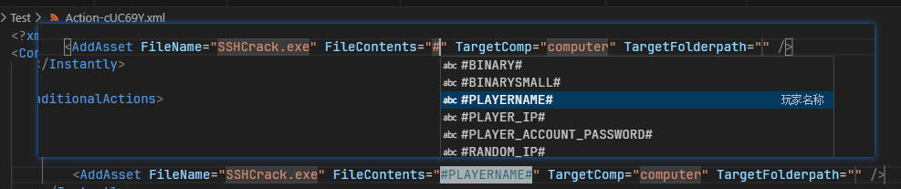
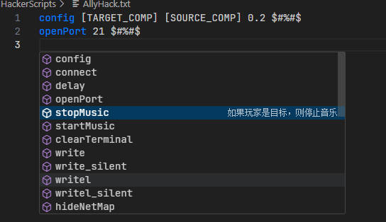
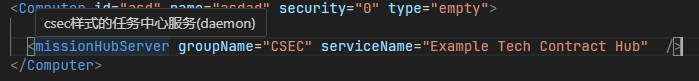

# Quick Start

Download link: [Hacknet Extension Writing Plugin](https://marketplace.visualstudio.com/items?itemName=fengxu30338.hacknetextensionhelper)

1. Create Editor Hint File

Press Ctrl + Shift + P, type "hacknet", and select "**Create Hacknet Editor Hint File**" to run



After creation, a Hacknet-EditorHint.xml file will be generated in the project root directory, which provides editor hints. You can customize this file to get editor hints after defining new Action tags with Pathfinder. Customization features will be introduced later.

Now you can start writing Hacknet Extension files happily. You can trigger hints by pressing `space` or the shortcut key `ctrl + enter`. It's worth noting that when writing tags, please try not to input `'<xxx'` as this will result in poor hint effects. You can follow these steps to get better hint effects:

```xml
<!-- 
If you need to add an admin tag, you shouldn't input <adxxx. 
You only need to input "ad" without the leading '<' symbol to get better hints.
Or you can directly press ctrl + enter at the place where you want hints for better results.
-->
```

Note: **The project root directory must be the root directory of the hacknet extension. Do not include multiple extensions at once, otherwise the hints may be incorrect.**

# Feature Introduction

Currently supported features:

- Create templates
- XML file hints
- #xx# text highlighting
- HackerScript file hints and highlighting
- Online theme debugging `(added in v0.0.2)`
- Tree-like node viewer for all Hacknet files
- Hot reload (requires [PathFinder](https://github.com/Arkhist/Hacknet-Pathfinder) installation)

## 1. Create Template Files

After right-clicking on a folder, you can see the following options. Select one to quickly create various template files:



**Create Project Template**

You can right-click on a folder, select Hacknet Extension -> Create Project Template to create a HacknetExtension project template (requires the root file to be empty):


You can also right-click on a folder and select to open an existing Hacknet extension file locally.

## 2. Code Hints

You can get context-based hints when writing the following types of files:

- Computer
- Action
- Mission
- Theme
- ExtensionInfo
- Faction
- HackerScript

You can trigger code hints by pressing "Ctrl + Enter" or `space` where you need hints:

> Code hint examples

Sub-tag hints:


Attribute name hints:



Attribute value hints:



Action file RunFunction segment hints:



Replacement text hints and highlighting:



HackerScript file hints and highlighting:



The plugin will give you the most accurate hint information based on your current cursor position, including attribute names (**some optional attributes won't appear directly, but you can trigger full hints via shortcut keys**), attribute values, and sub-tag hints.

## 3. View Tag Details

You can hover your mouse over a tag or attribute to view the usage of the tag/attribute:



## 4. Symbol Navigation

You can hold `Ctrl+left mouse button` to navigate to target files in the following places:

- Computer ID
- Any file path (Action files, Mission files, music files, image files, etc.)

There are symbol hints at navigable locations indicating that you can jump here:


## 5. Write Custom Hint Rules

You can add rules in `Hacknet-EditorHint.xml` to get custom tag hints.

### Basic Example

For example: Define hints for a Computer tag (partial):

```xml
<Node name="Computer" enable="true" multi="false" desc="Define a computer" fileTriggerPattern="Nodes/**/*.xml">
        <Content />
        <Attribute name="id" required="true" desc="Computer ID" />
        <Attribute name="name" required="true" desc="Computer name" />
   		 <Attribute name="security" required="true" desc="Computer security level" hint="enum">
            <Enums>
                <Enum desc="Icon style as old desktop computer">0</Enum>
                <Enum desc="Icon style as all-in-one computer">1</Enum>
                <Enum desc="Icon style as office computer">2</Enum>
                <Enum desc="Icon style as server">3</Enum>
                <Enum desc="Icon style as higher-level server">4</Enum>
            </Enums>
       	 </Attribute>
 <Node/>
```

The above defines hints for a Computer tag, which will give Computer hints at the outermost level.

- name: Attribute name
- enable: Whether to enable hints for this tag
- multi: Whether multiple instances of this tag can be defined
- desc: Description of the tag's function
- fileTriggerPattern: Only give hints on files in specific paths, such as all xml files under Nodes folders here

`Content` indicates that this tag has sub-tags, only one can be defined, and its **usage is exactly the same as Attribute**, with the only restriction being that only one can be defined.

`Attribute` defines the attributes of this tag, multiple can exist, with the following attributes:

- name: Attribute name
- required: Whether this attribute is required, otherwise it won't be generated in code snippets, but will still give users hints
- desc: Purpose of the attribute/content
- hint: Hint type, default is enum
- diag: Diagnostic level, values are "E, I, W, H", after setting this attribute, the editor will give hints for incorrect attribute values

> Hint Type Introduction

Currently supported hint types:

1. Enum (Enumeration type, usage as shown above)
2. EnumWithCommonString (Based on enumeration, adds some predefined strings, defined in the CommonTextHint tag in the code hint file)
3. JavaScript (Specifies custom js code to get hints, highest degree of freedom)
4. Computer (Provides all computer IDs in the current workspace for users to choose)
5. ComputerOrEos (Adds eos device ID provisioning based on Computer)
6. ActionFile (Action file path)
7. ThemeFile (Theme file path)
8. MisisonFile (Mission file path)
9. FactionFile (Custom faction file path)
10. PeopleFile (People file path)
11. Color (A color, provides 5 randomly generated colors for selection)
12. Path (Path selection, needs to provide matching path expressions)
13. Folder (Folder selection, needs to provide matching path expressions)
14. Step (Step-by-step matching, divides strings into multiple segments, each segment provides different matching, non-last segments can only use hint="step" type, last segment can use all hint types)

> JS Type Hint Usage

```xml
<!-- 
Here we use js to get all computer ip attributes in the current workspace for users to choose
node: Current mouse cursor node information, can get node attribute name-value relationships
// hacknetNodeHolder has methods to get all computer node information defined in the current workspace, similar ones include:
// GetComputers(), GetMissions(), GetActions(), GetThemes(), GetFactions(), GetPeoples(), GetOtherNodes()
// Log(msg) method can print a line of log in the output console for debugging, select HacknetExtensionHelper channel in the output window to view
// In the obtained nodes, you can call "__FullPath__" attribute to get the absolute path of the file where the node is located, and "__RelativePath__" attribute to get the relative path
[Note the escape of <>& and other characters]
-->
<Attribute name="ip" required="true" desc="IP of the computer where encryption is located" default="ip" hint="js" linkBy="Computer.ip">
    (function(node, hacknetNodeHolder){
        return hacknetNodeHolder.GetComputers()
            .filter(comp => comp.ip)
            .map(comp => {
            return {value: comp.ip, desc: comp.name, filterText: comp.id, kind: "reference"};
        });
    })
</Attribute>
```

> Path/Folder Type Hint Usage

```xml
<!-- 
1. When you set hint="path" or hint="folder", you must set the path matching expression in the content
    For example, **/*.ogg here means matching all files ending with .ogg in the current workspace, getting their relative paths for users to choose
    Image file expression: >**/*.{png,jpg,jpeg,bmp,ico} means files can end with png, jpg, etc.
2. This path setting hint method is usually used in conjunction with linkBy="path" to achieve the effect of jumping to the target file
-->
<Node name="HacknetExtension.IntroStartupSong" enable="true" multi="false" desc="Set the song played when first entering the game">
    <Content desc="Song file path (must be .ogg format)" hint="path" linkBy="path">**/*.ogg</Content>
</Node>
```

> Step Type Hint Usage

```xml
<Node name="ConditionalActions.*.RunFunction|CustomFaction.Action.RunFunction" enable="true" multi="true" desc="Execute built-in methods">
    <Attribute name="FunctionName" required="true" desc="Method name" default="" hint="step">
        <LinkByCollection>
            <Item linkBy="Faction.id" linkByValuePattern="setFaction:(.*)" />
            <Item linkBy="path" linkByValuePattern="loadConditionalActions:(.*)" />
            <Item linkBy="Computer.id|Computer.eosDevice.id" linkByValuePattern="setHubServer:(.*)" />
            <Item linkBy="Computer.id|Computer.eosDevice.id" linkByValuePattern="setAssetServer:(.*)" />
            <Item linkBy="path" linkByValuePattern="playCustomSong:(.*)" />
            <Item linkBy="path" linkByValuePattern="playCustomSongImmediatley:(.*)" />
        </LinkByCollection>
        <Step value="addRank" desc="Increase player's rank in the current organization and send email notification" kind="function" />
        <Step value="addRankSilent" desc="Increase player's rank in the current organization without sending email notification" kind="function" />
        <Step value="addRankFaction:" desc="Increase player's rank in the specified organization" kind="function">
            <Next hint="js">
                (function(actNode, hacknetNodeHolder){
                    return hacknetNodeHolder.GetFactions().map(node => {
                        return {value: node.id, kind: "enum"};
                    });
                })
            </Next>
        </Step>
     </Attribute>
</Node>
```

The above example shows the usage of Step, whose basic usage is similar to enum, giving users hints for the values defined in Step initially. When the user selects an item and prompts again, it enters the rules defined in the Next tag. The Next tag usage is the same as `Attribute tag`.

### **Sub-tag Example**

Define a sub-tag example for Computer:

```xml
<!--Represents <dlink target="advExamplePC2" /> -->
    <Node name="Computer.dlink" enable="true" multi="true" desc="Set other computers that can be scanned by this computer">
        <Attribute name="dlink" required="true" desc="Computer ID" default="id" hint="computer" linkBy="Computer.id|Computer.eosDevice.id" />
    </Node>
```

Multi-level sub-tags are separated by `.`, such as dlink here, name needs to be set to `Computer.dlink`. Setting name to belong to multiple sub-tags at the same time, separated by `|`, for example:

```xml
<!--
 Example of name belonging to multiple tags at the same time
 The name below belongs to both ConditionalActions.*.ChangeNetmapSortMethod
 and CustomFaction.Action.ChangeNetmapSortMethod
-->
<Node name="ConditionalActions.*.ChangeNetmapSortMethod|CustomFaction.Action.ChangeNetmapSortMethod" enable="true" multi="true" desc="Change network map node sorting method" />
```

**linkBy** attribute indicates jumping to the target file based on the actual attribute/content of the matched tag.

```
Example: Computer.id means searching for all computer id attributes in the current working directory. If they match the actual attribute, jump to the target file with that attribute. Use * to match any attribute name at the current level.
```

```
Use | to represent OR operation, for example: "Computer.id|Computer.eosDevice.id" means if either of these two attributes matches successfully, the overall match is successful, but the first level
```

**Must be the same** here means they must all start with `Computer.`

```xml
<!--
Currently available: Computer.* Mission.* Action.* Theme.* Faction.* People.* path(direct path jump) xml(xml file jump)
When linkBy="xml", you can pass more information through overrideValue attribute to precisely locate xml sub-tags
-->
<LinkByCollection>
      <Item linkBy="xml" 
            <!-- $(res) is the last result of the matching group when using regular matching, otherwise it's the actual tag attribute/content value -->
            <!-- | is used to separate multiple parameters
                Parameter 1: Relative path of xml file in extension root directory
                Parameter 2: Sub-tag path in xml file, a.b is the b tag under a tag
                Parameter 3: Matching attribute json string, if there are multiple identical tag paths, it will match the tag with the corresponding value based on the key in the json
             -->
            overrideValue="Plugins/$(res).xml|a.b|{\"c\": 1}" />
</LinkByCollection>
```

### **Multi-level linkBy**

```xml
<Node name="ConditionalActions.*.RunFunction|CustomFaction.Action.RunFunction" enable="true" multi="true" desc="Execute built-in methods">
    <Attribute name="FunctionName" required="true" desc="Method name" default="" hint="step">
        <LinkByCollection>
            <Item linkBy="Faction.id" linkByValuePattern="setFaction:(.*)" />
            <Item linkBy="path" linkByValuePattern="loadConditionalActions:(.*)" />
            <Item linkBy="Computer.id|Computer.eosDevice.id" linkByValuePattern="setHubServer:(.*)" />
            <Item linkBy="Computer.id|Computer.eosDevice.id" linkByValuePattern="setAssetServer:(.*)" />
            <Item linkBy="path" linkByValuePattern="playCustomSong:(.*)" />
            <Item linkBy="path" linkByValuePattern="playCustomSongImmediatley:(.*)" />
        </LinkByCollection>
        <Step value="addRank" desc="Increase player's rank in the current organization and send email notification" kind="function" />
        <Step value="addRankSilent" desc="Increase player's rank in the current organization without sending email notification" kind="function" />
        <Step value="addRankFaction:" desc="Increase player's rank in the specified organization" kind="function">
            <Next hint="js">
                (function(actNode, hacknetNodeHolder){
                    return hacknetNodeHolder.GetFactions().map(node => {
                        return {value: node.id, kind: "enum"};
                    });
                })
            </Next>
        </Step>
     </Attribute>
</Node>
```

LinkByCollection indicates defining a set of linkBy jump rules at the same time. If one rule matches successfully, it jumps according to that rule.

Item tags within LinkByCollection tags also have other attributes:

- `ignoreCaseForMatch` Whether to ignore case in regular matching
- `overrideValue` Use the value defined by this attribute to jump after successful matching
- `split` Use regular expressions to split, and give jump hints based on multiple split values at the same time

For example:

```xml
<Item linkBy="Faction.id" linkByValuePattern="setFaction:(.*)" />
```

Match the actual attribute with the regular expression defined in linkByValuePattern `(take the last value of the capture group)`. If the match is successful, jump according to the Faction.id rule. If not, continue trying the next linkBy rule.

When the plugin version >= `0.3.3`, the value of `overrideValue` tag can pass variables, for example:

```xml
<LinkByCollection>
      <Item linkBy="path" 
            linkByValuePattern="^adddegree|wipedegrees$"   
            ignoreCaseForMatch="true" 
            <!-- $(res) is the last result of the matching group when using regular matching, otherwise it's the actual tag attribute/content value -->
            overrideValue="Plugins/$(res).xml" />
</LinkByCollection>
```

### Conditional Attributes

You can add conditional attributes to dynamically prompt attributes.

Example:

```xml
<Node name="mission.goals.goal" enable="true" multi="true" desc="Define a goal that needs to be completed for a mission">
    <Attribute name="type" required="true" desc="Mission type" default="" hint="enum">
        <Enums>
            <Enum desc="Delete file">filedeletion</Enum>
    </Attribute>
    <ConditionAttributes attr="type" match="^filedeletion$">
        <Attribute name="target" required="true" desc="Computer ID where the file to be deleted is located" default="" hint="ComputerOrEos" linkBy="Computer.id|Computer.eosDevice.id" />
        <Attribute name="file" required="true" desc="File name" default="file.txt" hint="enum" />
        <Attribute name="path" required="true" desc="File path" default="home" hint="enum">
            <Enums kind="value">
                <Enum desc="home directory">home</Enum>
                <Enum desc="exe file storage directory">bin</Enum>
                <Enum desc="log directory">log</Enum>
                <Enum desc="system file directory">sys</Enum>
            </Enums>
        </Attribute>
    </ConditionAttributes>
</Node>
```

Use ConditionAttributes to define a conditional attribute. The above means that when the type attribute of the actual tag satisfies the regular expression defined by match, the sub-attributes defined inside it will be used for hints.

### Include Other Hint Files

Available in version >= `0.0.3`

The xml hint file `Hacknet-EditorHint.xml` adds an Include tag to reference other hint files. You can write a separate hint file for other mods used in your project for others to use.

> Example

```xml
<!-- Assume this file is located at Test/Test.xml in the project's relative path -->
<HacknetEditorHint>
    <Node name="Test" enable="true" multi="false" desc="Test new hint file">
        <Content />
    </Node>
</HacknetEditorHint>


<!-- The following file content is located in the Hacknet-EditorHint.xml file, just reference the Test.xml file defined above -->
<HacknetEditorHint>
    <!-- Some hint things are omitted here -->
    <!-- Reference other hint files here, using relative paths from the project root -->
	<Include path="Test/Test.xml" />
</HacknetEditorHint>
```

You can override the same attributes by defining the same Node and specifying the `repeatRule` attribute of Attribute tags, ConditionAttributes tags, and Content tags.

### Editor Error Detection

You can add a diag attribute to the Attribute tag or Content tag in the editor hint file to automatically detect file filling errors.

diag values are:

- E (Error level)
- W (Warning level)
- I (Message level)
- H (Hint level)

For example:

```xml
<Attribute name="security" required="true" desc="Computer security level" hint="enum" diag="W">
            <Enums>
                <Enum desc="Icon style as old desktop computer">0</Enum>
                <Enum desc="Icon style as all-in-one computer">1</Enum>
                <Enum desc="Icon style as office computer">2</Enum>
                <Enum desc="Icon style as server">3</Enum>
                <Enum desc="Icon style as higher-level server">4</Enum>
                <Enum desc="trace +100s, random firewall and proxy">5</Enum>
            </Enums>
</Attribute>
```

The above function will automatically detect whether the actual value you fill in is within the defined range when detecting the security attribute, otherwise it will pop up a warning.

#### More Complex Error Detection Functions

You can define Diag tags in the Attribute tags or Content tags of the editor hint file to achieve more complex error detection effects.

```xml
<Attribute name="type" required="true" desc="Mission type" default="" hint="enum">
            <Enums>
                <Enum desc="Delete file">filedeletion</Enum>
                <Enum desc="Clear folder">clearfolder</Enum>
            </Enums>
           // type is error error prompt level
          // ignoreCaseForEnum: Ignore case check when value is enum type
          // jsRuleFor detection rule, there are two types: attach and rewrite. Attach adds js validation on the basis of original rules, rewrite completely uses js rules for validation
            <Diag type="I" ignoreCaseForEnum="true" jsRuleFor="attach">
                  (function(actNode, hacknetNodeHolder, value){
                      // value is the actual value of the current attribute or content
                      return {msg: `In the mission with type=${type}, the content of modifyDeathRowRecord tag cannot be empty`, type: 'E'};
                  })
            </Diag>
</Attribute>>
```

## 6. Online Theme Debugging Function

Available in version >= `0.0.2`

You can click the debug theme button in the bottom right corner of the **theme** xml file to debug the theme online:


After clicking, a web-simulated interface will pop up in the sidebar. You can see the effect immediately in the web page after changing the xml.

More conveniently, when you hover your mouse over the element you want to modify on the web page for more than 3 seconds, the color used by that element will be highlighted in the left xml file, so you can more accurately locate the tag you want to modify.

## 7. Hacknet Node Viewing

Click "View" -> "Open View" in the title bar, search for Hacknet to find `Hacknet Node View` to open, with the following effect:


Click "View" -> "Open View" in the title bar, search for Hacknet to find `Hacknet Node Relationship View` to see the dependency count starting from the current computer:


## 8. Hacknet Hot Reload File Function

The hot reload function depends on [Pathfinder](https://github.com/Arkhist/Hacknet-Pathfinder), you need to install this component to use this function.

The hot reload function implementation depends on the PathFinder plugin: [HacknetHotReplace](https://github.com/fengxu-30338/HacknetHotReplace) (written by me, already open sourced on Github, you can implement other hot reload clients based on this).

Current functions:

1. Hot reload Computer
2. Connect to a specified Computer and grant admin permissions
3. Hot reload Mission files
4. Hot reload Action files
5. Hot reload Faction files
6. Hot reload Theme files
7. Hot reload People files (reload all People at once)
8. Dynamic execute Action files

Usage:

1. There is a hot reload icon in the upper right corner of the file editor, click it to hot reload:


2. In the menu that pops up when right-clicking on an xml document:

It will automatically infer available reload commands based on the current document type:


3. Dynamic Action Execution

You can open the Action file, click the execute button on the left side of the editor line number, and it will automatically wake up the game to execute the Action (please enter the extension before executing):

Note: When dynamically executing all actions under a Condition, the condition's conditions will be automatically ignored:

